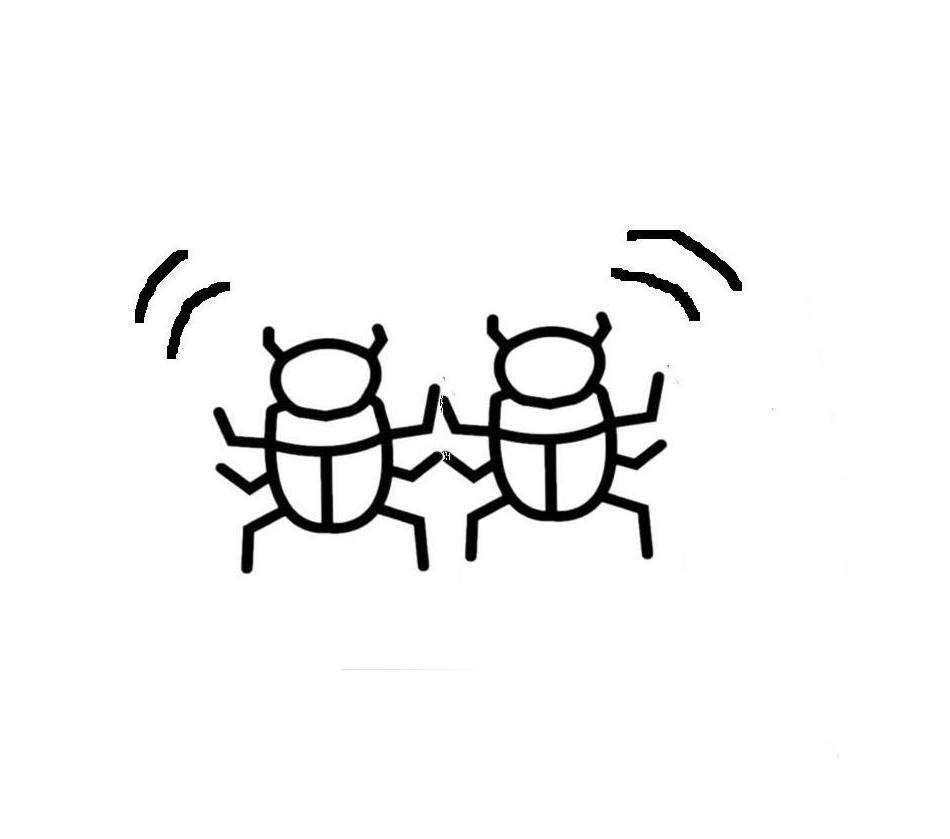
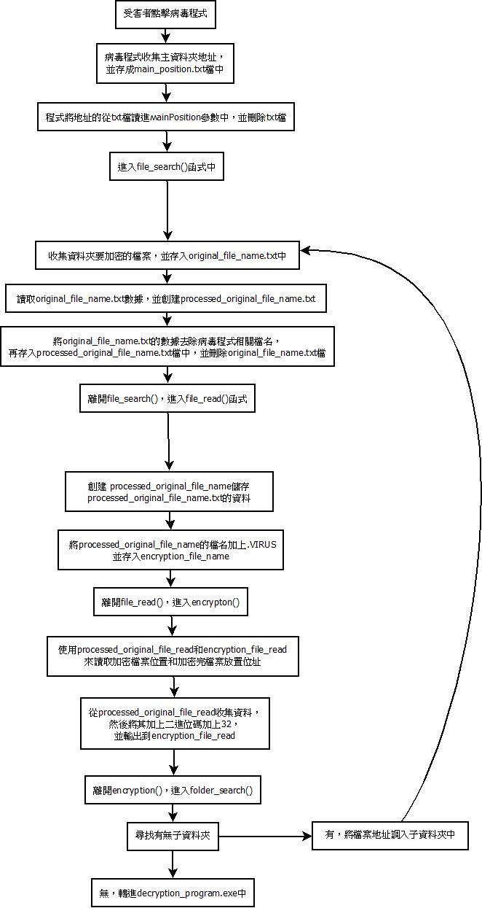
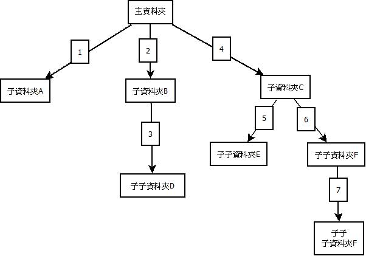
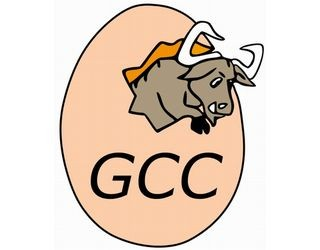
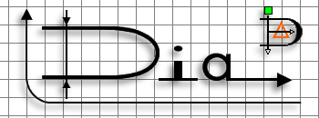

<h1 style="text-align:center">WannaMock勒索病毒製作報告</h1>

<h5 style="text-align:right">作者:HiCat</h5>



<h1 style="font-size: 60px;color:red;text-align:center">FBI WARNING</h1>

<h1 style="color:red;text-align:center">警告以下內容僅用於學術用途，使用後有任何金錢或法律問題，作者將不負責</h1>

#### 還有作者技術菜，製作的程式簡單又不完善、有任何解釋不全或者用語錯誤，還請諒解

# [想觀看2.6版以前的教學文檔請點這](material/README_2.6_before.md)

---

## 目錄:

1. ###  [病毒程式製作初衷](#1)

2. ### [WannaMock病毒製作歷程](#2)

3. [Wanna Mock 未來規劃](#3)

4. ### [WannaMock病毒本體介紹](#4)

5. ### [RSA加密WannaMock上的實作](#5)

6. ### [作者感想](#6)

7. ### [感謝](#7)

---

<h2 id="1">1.病毒程式製作初衷</h2>

###							在這資訊科技發達，人手一支手機的 時代裡，資訊安全不在只是在新聞上國家和公司V.S.駭客，大眾在旁當笑話看:「XX公司怎麼會被攻擊、OO央行怎麼會被入侵，好廢喔~。」這樣如此輕鬆的話題。但大眾卻還沒改變過往的觀念，渾然不知黑帽駭客們的魔爪以悄悄地伸入我們日常生活當中了。

### 				我自主學習程式語言才不到兩年，學習的時常還沒有很多，因為我沒有特地去補習或買書來加強實力，所以常常需要使用網路來查詢資料以此來學習程式相關的知識。但在自學的這段日子裡，我發現我最常查到的網路資料都是英文的，只有少部分試中寫的。雖然寫程式會英文是必須的，但在學習程式中還要去翻譯英文，這樣的學習效率實在太低了。

### 				我個人是開源項目的追隨者，自己使用的很多軟體都是開源的。像WannaMock的圖標示使用lnkspace製作、程式碼編輯器是使用emacs、C語言編譯器是使用GNU GCC來編譯的、、、等。所以我也以製作開源項目為我人生的目標。

### 				以上的三點原因，使我開始想製作有關資訊安全的程式製作教學文檔。在我思索要開發什麼來做教學文檔時，我無意間瀏覽到[WannaCry的維基百科](https://zh.wikipedia.org/zh-tw/WannaCry)，與資訊安全有關，我學習的C語言製作勒索軟件在是何不過了，所以WannaMock就此開始有了雛形出來。

---

<h2 id="2">2.WannaMock病毒製作歷程</h2>

### 		WannaMock是以滾動開發的方式進行製作。

### beta1.0版本是針對像txt檔的文字檔進行加密，製作流程還很簡陋。

### 2.0版本開始針對多檔案類型加密進行製作，程式邏輯還是使用beta的進行開發。

### 2.1版本是新的開始，程式碼和程式邏輯全部重新寫。此版本的更新開始支持子資料夾的檔案加密。

### 2.2版本加密程式沒有更新，而是對解密程式進行重寫，使它可以和使用者簡單的按鍵(使用按鍵1、2、3)進行互動。

### 2.3版本程式也沒有新功能，而是對程式碼進行優化，使其更容易讀。

### 2.4版本是理論上的最終版本，對RSA加密進行測試。

### 2.4.1版本解決了解密程序在C槽執行時會導致資料遺失的問題。

### 2.4.2版本解決了加密程序因儲存陣列過大而溢位導致執行到第三層子資料夾時會閃退的問題。

### 2.5版本是一個彩蛋，將程式偽裝成一個.jpg的照片檔，但會被防毒軟體查殺。

### 2.6版本修復了程式副檔名和VIRUS(擇一相同時)或有中文檔名時，檔名會被誤刪的問題。

### 2.7版本重新編排程式碼，使其更容易讀。

### 2.7.1版本修復RSA再加解密檔案時會使檔案壞掉的問題。

### 2.7.2版本使解密金鑰為不固定數(亂數生成)，此版本為第二週期最後版本。

### 2.7.3版本本希望加入RSA_V2程式碼，但最後失敗了，無法正常進行RSA加解密，可能是動態配置記憶體導致記憶體溢位(注意此為不安全版本)。

---
<h2 id="3">3.Wanna Mock 未來規劃</h2>

|      版本      | 規劃                                                         |
| :------------: | :----------------------------------------------------------- |
| 第二周期(V2.X) | 此版本結束後，Wanna Mock將成為一個完整可用的病毒程式。       |
| 第三周期(V3.X) | 加入資安教學遊戲，受害者需玩完遊戲才可取得解密金鑰。         |
| 第四周期(V4.X) | 加入作業系統或軟體漏洞，加強Wanna Mock躲避防毒軟體的能力。此周期將是Wanna Mock的最後一個開發週期。 |

### 上述版本做完後，Wanna Mock也將結束開發。除非有新點子，否則Wanna Mock將不再加入新功能。後續將只進行錯誤修復。

---

<h2 id="4">4.WannaMock病毒本體介紹</h2>

###							WannaMock介紹以最終版本(2.7.2)進行介紹。因為解密程式和加密程式的程式邏輯差不多，所以我們在此不多贅述解密程式。再詳細介紹加密程式的程式邏輯時，先放上加密程式的流程圖，讓大家能更容易理解WannaMock的製作邏輯。



### 		當WannaMock的encryption_program.exe程式被使用者點擊後，先創建(字串函數)MainPosition，然後用system()去收集主資料夾的地址存入(字串函數)MainPosition中。進入file_search()中，使用system()收集主資料夾可加密的檔案，並存入original_file_name.txt中。再使用(FILE函數)* original_file_name_read去讀取original_file_name.txt，去除WannaMock使用的檔案後使用(FILE函數)* processed_original_file_name_read存入processed_original_file_name.txt中。

### 		離開file_search()，然後進入file_read()，使用(FILE函數)* processed_original_file_name_read去讀processed_original_file_name.txt，然後用(字串函數)processed_original_file_name去收集可加密檔案的檔名，並將可加密檔案的檔名加上.VIRUS並存入encryption_file_name。

### 		進入encryption()，用(FILE函數)* processed_original_file_read讀去鑰加密的檔案，將讀取的訊息二進位碼加上32，然後使用(FILE函數)* encryption_file_read去存加密完的訊息。

### 		進入folder_search()，system()收集子資夾，使用(FILE函數)* folder_name_read，然後和MainPosition合併。然後再進入file_search()進行遞迴，如過有子資料夾還有子資料夾就再進去，直到沒有子資料夾，就退到上一個資料夾，檢查還有沒有沒加資料夾，直到退回主資料夾，進入decryption_program.exe。

### 以下是子資料夾加密的流程圖:



---

<h2 id="5">5.RSA加密WannaMock上的實作</h2>

### 						在講解[RSA加密](https://zh.wikipedia.org/wiki/RSA加密演算法)WannaMock上的實作前，我們先來看看RSA是如何進行加解密的。


### 		在進行RSA加密前，我們先要找幾個數，才能成功進行接下來的流程:

#### 					1. 找兩個質數p和q，並且p和q不相同。在算出 N = p * q。

#### 					2. 在用歐拉函數，求得 r = ( p - 1 ) * ( q - 1 )。

#### 					3. 在選擇一個小於 r 的整數 e，並且 e 與 r 要互質。

####						4. 最後找出 d，並且 d * e  除以 r 的餘數要等於 1 。


### 		這樣我們就可以開始進行我們的RAS加密了:

### 			M = 原始訊息、C = 加密完的密文

### 			加密訊息(C) :  C = M 的 e 次方除N的餘數。

### 			解密訊息(M) :  M = C 的 d 次方除 N的餘數。

### 已下放上簡易的RSA加密所需物件表:

|  | RSA加密 |
| - | - |
| 公鑰 | e |
|私鑰| d |
| 加密 | C = M^e ( mod N ) |
| 解密 | M = C^d ( mod N ) |


### 放上我測試RSA加密時的C語言程式碼:

```c
#include <stdio.h>
#include <stdlib.h>
#include <string.h>

int RSA(int x, int y, int z) {
    int result = 1 % z;
    x %= z;
    while (y != 0) {
        if ((y & 1) == 1) {
            result = (result * x) % z;
        }
        x = (x * x) % z;
        y >>= 1;
    }
    return result;
}

int main(void){
  //p=11, q=17, n=p*q = 187, (p-1)(q-1) = 160, e=7, d=23,

  long long int c = RSA(123, 7, 187);
  printf("%d\n", c);

  long long int m = RSA(c, 23, 187);
  printf("%d\n", m);
  
  return 0;
}
```


### 使用快速冪取模演算法可以簡單的實現RSA加密，快速冪取模演算法可以去[這裡](https://www.youtube.com/watch?v=GbDtCFhq20A)觀看詳細教程。以下簡單介紹快速冪取模演算法觀念:

### RSA加密需要用極大數(國家標準暨技術研究院[ NIST ]建議的RSA密鑰長度至少2048位元)並算其e次方，一般長度的密碼，電腦可以簡單解決。但當數字長度大到一個值時，電腦的儲存格會溢位而導致結果錯誤，所以我們需要快速冪取模演算法去解決這個問題。

### 快速冪取模演算法是將長長度數字拆解成二的冪的短長度數字取餘數，像以下這樣

```
(a^105)%b = ( (a^1)%b * (a^8)%b * (a^32)%b * (a^64)%b )%b
```

### 麻煩就是在將長長度數字拆解成二的冪的短長度數字，這問題可以用二進制來解決。先把105換成二進制

```
105 = 1101001
```

### 不知道大家有沒有看出什麼，我們把1、8、32、64的二進制碼放上去，大家可能比較看的出來

```
105 = 1 1 0 1 0 0 1
1   = 0 0 0 0 0 0 1
8   = 0 0 0 1 0 0 0
32  = 0 1 0 0 0 0 0
64  = 1 0 0 0 0 0 0
```

### 其實就是二進制的數字將其的每個1單獨拆開就可以找到加起來等於其數字的二的冪的數字了

### 所以我們要做的事是將不是二的冪的數字其二進制的1各別挑出來組成一個二的冪的數字，將這數字取餘數乘起來，最後在取一次餘數，就可以快速冪取模演算法完成RSA加密了。(不懂可以去看連結，連結的教程影片講得比較清楚)


### 現在開始來講解RSA加密在WannaMock的實作。

### 在2.7版以後，我對Wanna Mock重新進行了程式規劃，將RSA加密引入進檔案加解密中(2.6版本以前是檔案加密用凱薩密碼，金鑰認證機制使用RSA加密)。那為何我不再2.6以前就這樣做?其實我當初設計時就希望RSA加密使用在檔案上，但因為這樣會導致檔案的損壞，所以我才放棄這樣做。

### 在近期我重新回歸WannaMock的新功能開發後，我決定解決RSA加解密檔案的問題，所以我就花了一個晚上的時間去試著修復它。

### 最後我發現是WannaMock在進行檔案二進制碼讀取時，使用char資料型態，但此型態再進行RSA加密時會產生溢位(無法過255，原因還在調查)，所以我之後改成(char)接收檔案的二進制碼，再放進(int)中進行RSA加密，再將(int)存入加密檔中。

### 解密時就是反過來所以我之後改成(int)接收檔案的二進制碼，再放進(int)中進行RSA加密，再將(char)存入解密檔中。


---


<h2 id="6">6.作者感想</h2>

### 作者本人編程學習不到兩年，在製作WannaMock和寫這個教學文檔時，可能有程式設計不好或文檔寫不好的地方，還請大家多多見諒。

### 本人在製作這個專案時，也因此學習到很多知識，像C語言的檔案讀寫、遞迴的熟練和RSA加密。所以我想在做一期教學文檔是關於radare2逆向工程的教學及實做。

### 在製作WannaMock時，我也遇到了很多問題要克服，英文資料的閱讀、有空格字符檔名的檔案加密、子資料夾檔案加密、RSA加密和製作這個文檔的乏味時間等，最後我還是打擺重重難關做完了WannaMock這個項目，我本人是還蠻滿意這個項目的。

### 在初期製作我在策畫WannaMock的開發時，我有非常多的點子想放入WannaMock中，但在製作時不斷遇到問題，和個人生活的困境也不斷壓迫著我，在這樣的雙重打擊下我甚至在2.5版製作完後有想要放棄繼續開發WannaMock，所以在2.6版以前我都只進行了已知問題的修復。

### 但在近期我 想找回當初學習程式語言和開發項目的初衷，所以我回歸重新開發WannaMock並訂定了新的未來規劃。也在近期的製作中找回手感，第二週期也以製作完成，在後期我將繼續開發WannaMock，直到遊戲的規劃和隱匿功能的完成。才會結束開發。

### 最後在此感謝大家閱讀完我的教學文檔，今後我的其他教學文檔或開源項目請大家也繼續支持，我是Hi Cat，我們在其他開源項目見。

### 此教學文檔是在2.7.2版重新製作的，砍掉了照片偽裝和(已被修復)WannaMock破解等教學，想觀看可至最上方的鏈接觀看。

---

<h2 id="7">7.感謝</h2>

### [markdown](https://zh.wikipedia.org/wiki/Markdown)及其非常好用的編輯器 [Typora](https://typora.io/)


---

### GNU 的 文字編輯器[emacs](https://www.gnu.org/software/emacs/)和C語言編譯器[GCC](https://gcc.gnu.org/)




---

### 逆向工程利器[radare2](https://rada.re/n/)


---

### 流程圖製作神器[DIA](http://dia-installer.de/)



---

### 圖形編輯專家[Inkscape](https://inkscape.org/zh-hant/)


---

### 辦公好幫手[LibreOffice](https://zh-tw.libreoffice.org/)


---

### [github](https://github.com/)


<h4 style="text-align:center">2021/1/25 Made by:Hi Cat</h4>		
