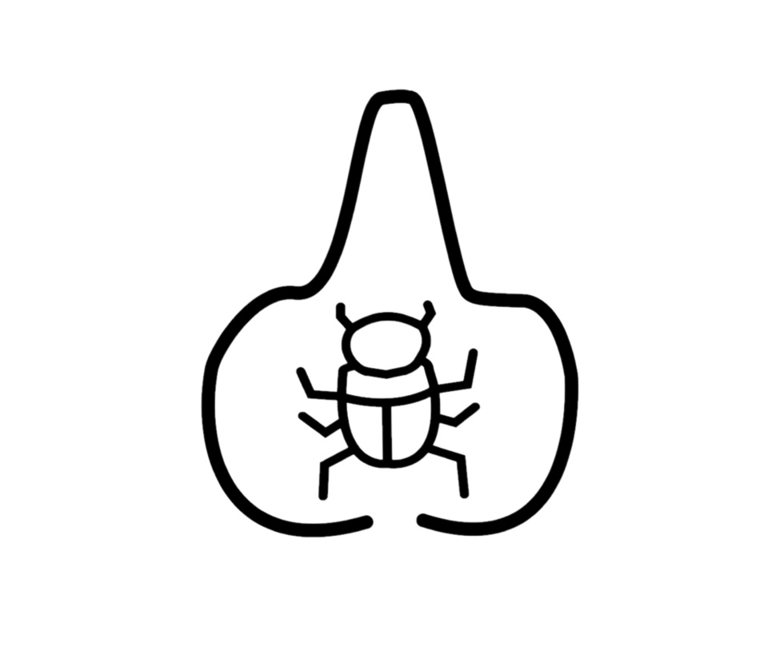
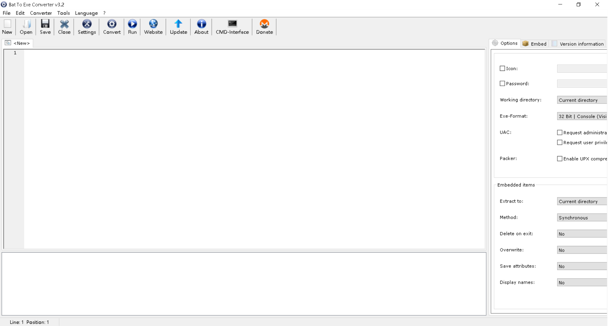
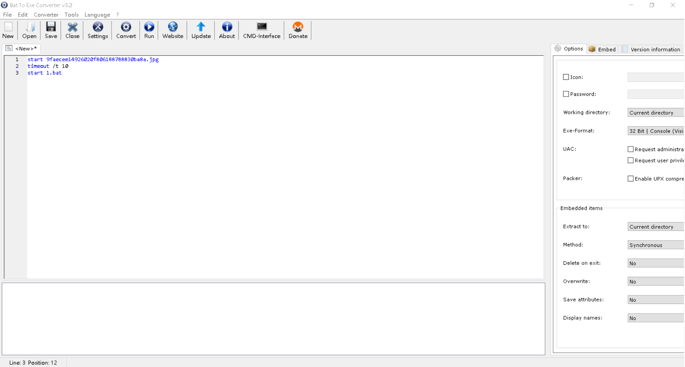
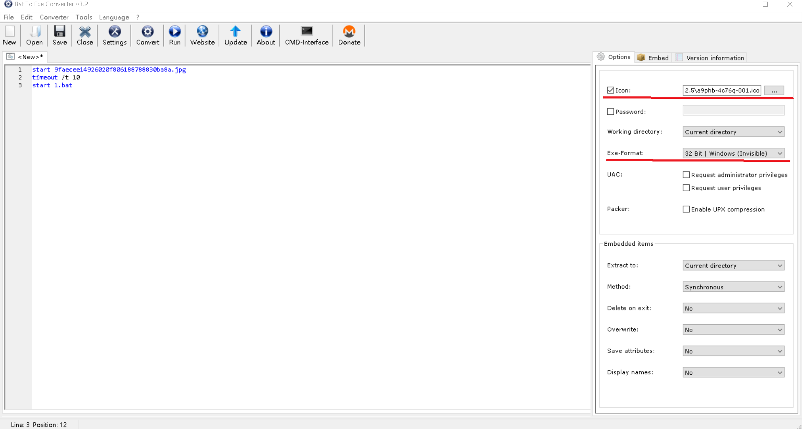
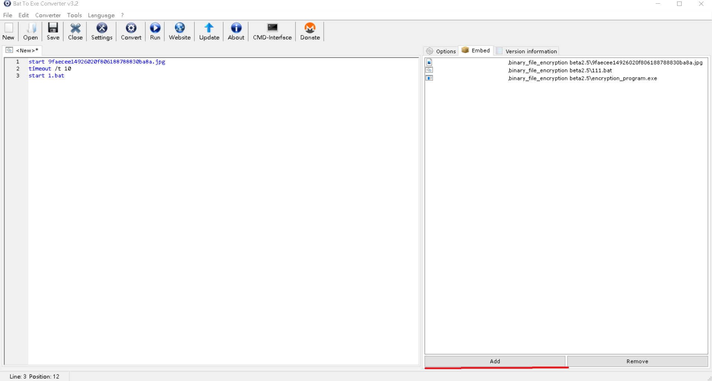
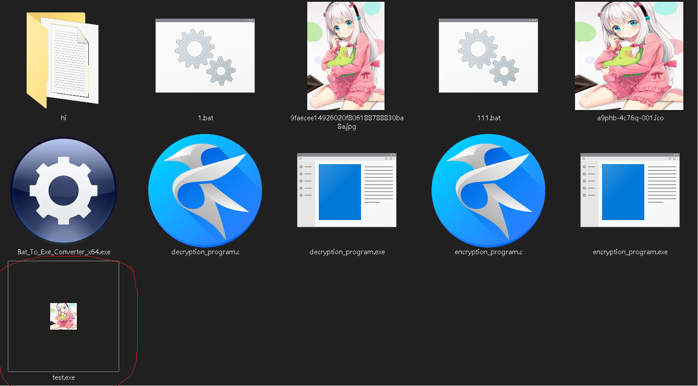
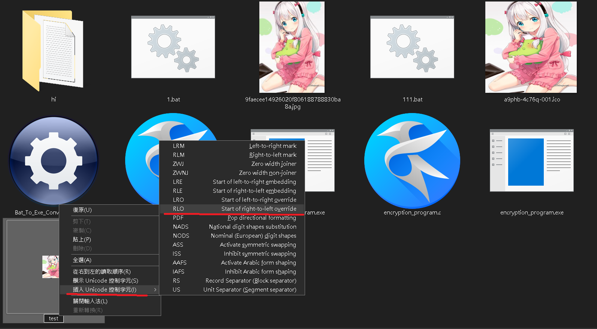
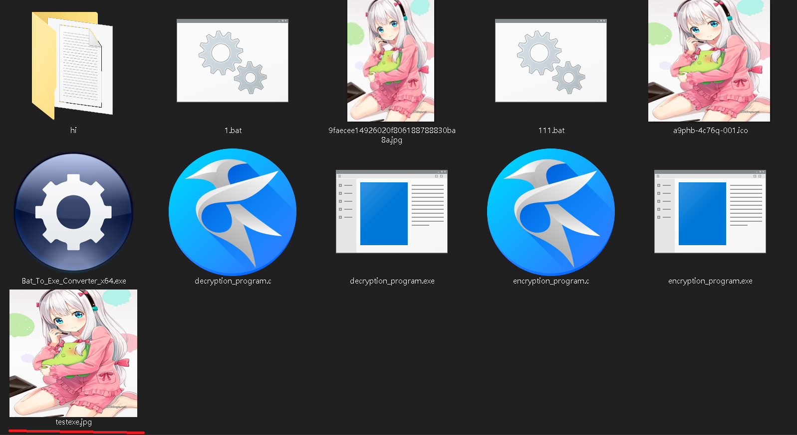

<h1 style="text-align:center">WannaMock勒索病毒製作報告</h1>

<h5 style="text-align:right">作者:HiCat</h5>



<h1 style="font-size: 60px;color:red;text-align:center">FBI WARNING</h1>

<h1 style="color:red;text-align:center">警告以下內容僅用於學術用途，使用後有任何金錢或法律問題，作者將不負責</h1>

#### 還有作者技術菜，製作的程式簡單又不完善、有任何解釋不全或者用語錯誤，還請諒解

---

## 目錄:

1. ###  [病毒程式製作初衷](#1)

2. ### [WannaMock病毒製作歷程](#2)

3. ### [WannaMock病毒本體介紹](#3)

4. ### [RSA加密WannaMock上的實作](#4)

5. ### [破解WannaMock](#5)

6. ### [將程式偽裝成.jpg照片檔](#6)

7. ### [作者感想](#7)

8. ### [感謝](#8)

---

<h2 id="1">1.病毒程式製作初衷</h2>

###							在這資訊科技發達，人手一支手機的 時代裡，資訊安全不在只是在新聞上國家和公司V.S.駭客，大眾在旁當笑話看:「XX公司怎麼會被攻擊、OO央行怎麼會被入侵，好廢喔~。」這樣如此輕鬆的話題。但大眾卻還沒改變過往的觀念，渾然不知黑帽駭客們的魔爪以悄悄地伸入我們日常生活當中了。

### 				我自主學習程式語言才不到兩年，學習的時常還沒有很多，因為我沒有特地去補習或買書來加強實力，所以常常需要使用網路來查詢資料以此來學習程式相關的知識。但在自學的這段日子裡，我發現我最常查到的網路資料都是英文的，只有少部分試中寫的。雖然寫程式會英文是必須的，但在學習程式中還要去翻譯英文，這樣的學習效率實在太低了。

### 				我個人是開源項目的追隨者，自己使用的很多軟體都是開源的。像WannaMock的圖標示使用lnkspace製作、程式碼編輯器是使用emacs、C語言編譯器是使用GNU GCC來編譯的、、、等。所以我也以製作開源項目為我人生的目標。

### 				以上的三點原因，使我開始想製作有關資訊安全的程式製作教學文檔。在我思索要開發什麼來做教學文檔時，我無意間瀏覽到[WannaCry的維基百科](https://zh.wikipedia.org/zh-tw/WannaCry)，與資訊安全有關，我學習的C語言製作勒索軟件在是何不過了，所以WannaMock就此開始有了雛形出來。

---

<h2 id="2">2.WannaMock病毒製作歷程</h2>

### 		WannaMock是以滾動開發的方式進行製作。

### beta1.0版本是針對像txt檔的文字檔進行加密，製作流程還很簡陋。

### 2.0版本開始針對多檔案類型加密進行製作，程式邏輯還是使用beta的進行開發。

### 2.1版本是新的開始，程式碼和程式邏輯全部重新寫。此版本的更新開始支持子資料夾的檔案加密。

### 2.2版本加密程式沒有更新，而是對解密程式進行重寫，使它可以和使用者簡單的按鍵(使用按鍵1、2、3)進行互動。

### 2.3版本程式也沒有新功能，而是對程式碼進行優化，使其更容易讀。

### 2.4版本是理論上的最終版本，對RSA加密進行測試。

### 2.4.1版本解決了解密程序在C槽執行時會導致資料遺失的問題。

### 2.4.2版本解決了加密程序因儲存陣列過大而溢位導致執行到第三層子資料夾時會閃退的問題。

### 2.5版本是一個彩蛋，將程式偽裝成一個.jpg的照片檔，但會被防毒軟體查殺。

### 2.6版本修復了程式副檔名和VIRUS(擇一相同時)或有中文檔名時，檔名會被誤刪的問題。

---

<h2 id="3">3.WannaMock病毒本體介紹</h2>

###							WannaMock介紹以最終版本(2.6)進行介紹。因為解密程式和加密程式的程式邏輯差不多，所以我們在此不多贅述解密程式。再詳細介紹加密程式的程式邏輯時，先放上加密程式的流程圖，讓大家能更容易理解WannaMock的製作邏輯。


### 						可能會有人好奇怎麼沒有RSA加密?我其實也有嚐試將RSA加密引入文件加密的代碼中，但因為這樣效能實在會消耗龐大，和本人技術有限，所以我只好將RSA加密放進解密程式中對使用者輸入的密碼進行RSA加密來推進解密程式進行解密，詳細將在第四章[RSA加密WannaMock上的實作](#4)來介紹。

### 		當WannaMock的encryption_program.exe程式被使用者點擊後，先創建(字串函數)MainPosition，然後用system()去收集主資料夾的地址存入(字串函數)MainPosition中。進入file_search()中，使用system()收集主資料夾可加密的檔案，並存入original_file_name.txt中。再使用(FILE函數)* original_file_name_read去讀取original_file_name.txt，去除WannaMock使用的檔案後使用(FILE函數)* processed_original_file_name_read存入processed_original_file_name.txt中。

### 		離開file_search()，然後進入file_read()，使用(FILE函數)* processed_original_file_name_read去讀processed_original_file_name.txt，然後用(字串函數)processed_original_file_name去收集可加密檔案的檔名，並將可加密檔案的檔名加上.VIRUS並存入encryption_file_name。

### 		進入encryption()，用(FILE函數)* processed_original_file_read讀去鑰加密的檔案，將讀取的訊息二進位碼加上32，然後使用(FILE函數)* encryption_file_read去存加密完的訊息。

### 		進入folder_search()，system()收集子資夾，使用(FILE函數)* folder_name_read，然後和MainPosition合併。然後再進入file_search()進行遞迴，如過有子資料夾還有子資料夾就再進去，直到沒有子資料夾，就退到上一個資料夾，檢查還有沒有沒加資料夾，直到退回主資料夾，進入decryption_program.exe。

### 以下是子資料夾加密的流程圖:


---

<h2 id="4">4.RSA加密WannaMock上的實作</h2>

### 						在講解[RSA加密](https://zh.wikipedia.org/wiki/RSA加密演算法)WannaMock上的實作前，我們先來看看RSA是如何進行加解密的。


### 		在進行RSA加密前，我們先要找幾個數，才能成功進行接下來的流程:

#### 					1. 找兩個質數p和q，並且p和q不相同。在算出 N = p * q。

#### 					2. 在用歐拉函數，求得 r = ( p - 1 ) * ( q - 1 )。

#### 					3. 在選擇一個小於 r 的整數 e，並且 e 與 r 要互質。

####						4. 最後找出 d，並且 d * e  除以 r 的餘數要等於 1 。


### 		這樣我們就可以開始進行我們的RAS加密了:

### 			M = 原始訊息、C = 加密完的密文

### 			加密訊息(C) :  C = M 的 e 次方除 r 的餘數。

### 			解密訊息(M) :  M = C 的 d 次方除 r 的餘數。

### 已下放上簡易的RSA加密所需物件表:

|  | RSA加密 |
| - | - |
| 公鑰 | e |
|私鑰| d |
| 加密 | C = M^e ( mod N ) |
| 解密 | M = C^e ( mod N ) |


### 放上我測試RSA加密時的C語言程式碼:

```c
#include <stdio.h>
#include <stdlib.h>
#include <string.h>

int RSA(int x, int y, int z) {
    int result = 1 % z;
    x %= z;
    while (y != 0) {
        if ((y & 1) == 1) {
            result = (result * x) % z;
        }
        x = (x * x) % z;
        y >>= 1;
    }
    return result;
}

int main(void){
  //p=11, q=17, n=p*q = 187, (p-1)(q-1) = 160, e=7, d=23,

  long long int c = RSA(123, 7, 187);
  printf("%d\n", c);

  long long int m = RSA(c, 23, 187);
  printf("%d\n", m);
  
  return 0;
}
```


### 使用快速冪取模演算法可以簡單的實現RSA加密，快速冪取模演算法可以去[這裡](https://www.youtube.com/watch?v=GbDtCFhq20A)觀看詳細教程。以下簡單介紹快速冪取模演算法觀念:

### RSA加密需要用極大數(國家標準暨技術研究院[ NIST ]建議的RSA密鑰長度至少2048位元)並算其e次方，一般長度的密碼，電腦可以簡單解決。但當數字長度大到一個值時，電腦的儲存格會溢位而導致結果錯誤，所以我們需要快速冪取模演算法去解決這個問題。

### 快速冪取模演算法是將長長度數字拆解成二的冪的短長度數字取餘數，像以下這樣

```
(a^105)%b = ( (a^1)%b * (a^8)%b * (a^32)%b * (a^64)%b )%b
```

### 麻煩就是在將長長度數字拆解成二的冪的短長度數字，這問題可以用二進制來解決。先把105換成二進制

```
105 = 1101001
```

### 不知道大家有沒有看出什麼，我們把1、8、32、64的二進制碼放上去，大家可能比較看的出來

```
105 = 1 1 0 1 0 0 1
1   = 0 0 0 0 0 0 1
8   = 0 0 0 1 0 0 0
32  = 0 1 0 0 0 0 0
64  = 1 0 0 0 0 0 0
```

### 其實就是二進制的數字將其的每個1單獨拆開就可以找到加起來等於其數字的二的冪的數字了

### 所以我們要做的事是將不是二的冪的數字其二進制的1各別挑出來組成一個二的冪的數字，將這數字取餘數乘起來，最後在取一次餘數，就可以快速冪取模演算法完成RSA加密了。(不懂可以去看連結，連結的教程影片講得比較清楚)


### 現在開始來講解RSA加密在WannaMock的實作。

### 我一開始設計WannaMock時，本來是打算直接將RSA加密實際應用在檔案加密的工作環節中。但當我真的去實際開發時，我發現了兩個問題，一是我的程式編程能力有限，自己製作出來的程式碼都有瑕疵；二是RSA加密的速度實在是太慢了。這兩點因素導致我最後只好將其從檔案加密中刪除。

### 我最後不得以只好將RSA加密應用在金鑰解密的工作上。

### 程式將要使用者輸入解密金鑰，解密金鑰經過RSA解密後輸出原始金鑰，程式在檢查原始金鑰是否正確。其實沒有什麼實際的用途，只是我想將RSA加密應用進WannaMock而已。

### (原始金鑰)123 -> 183(加密後的金鑰)

### 輸入183後RSA解密轉乘123，金鑰正確，開始後續的解密程序。


---

<h2 id="5">5.破解WannaMock</h2>

### 在做結尾前，我覺得不應該只教大家做電腦病毒，應該也要大家如何抵禦電腦病毒，所以我就在左思右想，要如何破解WannaMock病毒。我就想到WannaMock的RSA加密其實沒有多少保護力，所以我就想以此為突破口，其實非常簡單，現在教大家如何破解WannaMock。

### 在破解WannaMock前，我們需要先安裝[radare2](https://rada.re/n/)，可以去它們的官網[下載](https://radare.mikelloc.com/list)程式，要教學radare2我可能以後再做一期專題來教大家，這裡先不做說明，專注講如何破解WannaMock。

### 進cmd輸入

```
r2 -w decryption_program.exe
```

### 成功進入radare2後，然後輸入

```
aaa
```

### 再輸入

```
pdf @ sym.main
```


### 可以看到decryption_program.exe的程式碼，藍色線是會跳轉的程式碼會往哪一列跳，最左邊是列碼，第二行是機械語言，第三行是組合語言，最右是註釋，往下滑會看到列碼是0x00402a0d(組合語言位置需自行找，不一定在此)的那一列程式碼


### 是用來檢查輸入的金鑰RSA解密後是否正確，正確的話望下一列走，不正確就跳轉到以下段落的0x00402d31(組合語言位置需自行找，不一定在此)


### 我們要做的就是不管輸入什麼金鑰，程式都要往下走，所以我們要做的是修改程式碼，入程式在金鑰輸錯時，還是往下一列跳

### 接下來我們來實際操作

### 輸入以下指令，跳轉到想修程式碼位置的那一列(組合語言位置需自行找，不一定在此)

```
s 0x004002a0d(組合語言位置需自行找，不一定在此)
```

### 可以看到黃色的前墜文字改變了


### 然後再輸入，讓程式輸錯時還是往下一列跳(組合語言位置需自行找，不一定在此)

```
"wa jne 0x00402a13"
```

### 看到以下文字表示成功


### 我們再輸入

```
pdf @ sym.main
```

### 可以看到0x004002a0d(組合語言位置需自行找，不一定在此)的程式碼改了，至接跳轉到下一列


### 此時我們exit退出radare2後，點decryption_program.exe，然後輸入金鑰，不管我們輸入多少，程式都會幫我們進行解密。

### WannaMock的解密我們就介紹到這邊。

---
<h2 id="6">6.將程式偽裝成.jpg照片檔</h2>

### 首先需要一個叫Bat_To_Exe_Converter_x64.exe的程式，它是一個免費軟體，將程式和照片合併起來。



### 打開後長這樣，可以點最上方的Language將介面改成中文。

### 再來，在左邊的輸入欄裡寫入

```
start [要放入的照片名]
timeout /t 10 	//將程式停止10秒
start 1.bat
```



### 在創建一個叫1.bat的檔案，然後用文本編輯器寫入

```
start [要放入的程式名]
taskkill /im cmd.exe
taskkill /im conhost.exe
```

### 然後，將右邊列內的Exe-Format欄改成 32 Bit | Windows (Invisible)，然後可以選擇自己要的Icon，但要.ico檔

###   

### 再來點選 Embed，將照片、.bat檔和程式匯入



### 這樣就可以點擊上方的Convert將程式匯出，回出時會要建一個.bat程式，隨便建就可以了，再來會要建一個.exe檔這就是做好的程式



### 圖片要選好(最好照片是要正方形的)，不然轉成.ico會像我的依樣奇怪。

### 這樣基本上是已經做完了，但名字是.exe會很奇怪，所以我們將程式重新命名，先隨便取一個名字，再來對命名欄點右鍵，選插入Unicode控制元件的RLO，這樣接下來打的字將反過來(像打jpg.exe變成exe.gpj)，然後再打jpg.exe



### 會變成像這樣



### 這樣就大功告成可以玩了，開啟它會跳出一個照片，十秒後程式會啟動，前提是防毒軟體已經關閉。

### 只要不右鍵打開內容，基本上是看不出來，所以以後大家打開檔案前先注意一下內容裡是否附檔名一致，

### 還有本版本的加密程式是有修改過的，以防止加密程式加密偽圖片檔。

### 本教學就到這邊。

---


<h2 id="7">7.作者感想</h2>

### 作者本人編程學習不到兩年，CTF的逆向工程自學也不到一個月，在製作WannaMock和寫這個教學文檔時，可能有程式設計不好或文檔寫不好的地方，還請大家多多見諒。

### 本人在製作這個專案時，也因此學習到很多知識，像C語言的檔案讀寫、遞迴的熟練和RSA加密。所以我想在做一期教學文檔是關於radare2逆向工程的教學及實做。

### 在製作WannaMock時，我也遇到了很多問題要克服，英文資料的閱讀、有空格字符檔名的檔案加密、子資料夾檔案加密、RSA加密和製作這個文檔的乏味時間等，最後我還是打擺重重難關做完了WannaMock這個項目，我本人是還蠻滿意這個項目的。

### 在此感謝大家閱讀完我的教學文章，今後我的其他教學文檔或開源項目請大家也繼續支持，我是Hi Cat，我們之後見。

---

<h2 id="8">8.感謝</h2>

### [markdown](https://zh.wikipedia.org/wiki/Markdown)及其非常好用的編輯器 [Typora](https://typora.io/)


---

### GNU 的 文字編輯器[emacs](https://www.gnu.org/software/emacs/)和C語言編譯器[GCC](https://gcc.gnu.org/)


---

### 逆向工程利器[radare2](https://rada.re/n/)


---

### 流程圖製作神器[DIA](http://dia-installer.de/)


---

### 圖形編輯專家[Inkscape](https://inkscape.org/zh-hant/)


---

### 辦公好幫手[LibreOffice](https://zh-tw.libreoffice.org/)


---

### [github](https://github.com/)


<h4 style="text-align:center">2021/1/25 Made by:Hi Cat</h4>		
